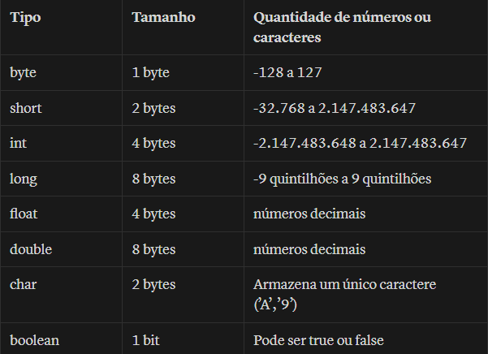

# Tipos Primitivos
Os tipos primitivos são uma classificação de variáveis.

**Exemplo de declaração de variável:**

`int age = 10;`

**Observações:**

O que diferencia os tipos são a quantidade que cada um pode armazenar na memória.

**Tipo byte** - ocupa 1 byte de memória, ou seja 8 bits. O seu máximo é 1111 1111 que equivale ao valor 255 em decimal.

Mas a metade dos 256 valores é usado para números negativos ( -128 a -1) e a outra metade de (0 a 127).

**Tipo char** - trabalha com a tabela ASCII e a Unicode.

Exemplo

`*char* caractere = 65;`

A saída será a letra A, de acordo com a tabela ASCII.